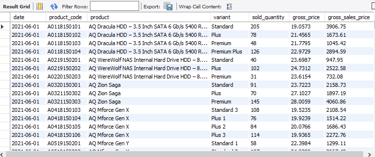
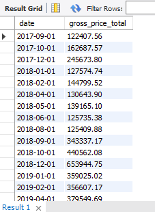
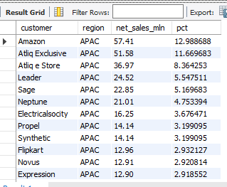
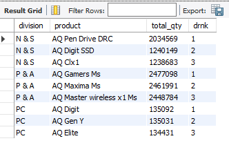

# 📊 AtliQ Hardware Sales & Finance Analytics using MySQL

## 📌 Project Overview

This project focuses on solving real-world business analytics problems using MySQL for AtliQ Hardware.

The project simulates business requirements given by product owners and converts them into SQL-based analytical reports. It covers sales analysis, financial reporting, market performance tracking, and advanced SQL reporting workflows using real business scenarios.

The objective of this project is to demonstrate practical SQL skills used in real-world data analytics and business intelligence environments.


# 📂 Recommended GitHub Folder Structure

```bash
MYSQL-SALES-ANALYTICS/
│
├── Dataset/
├── Functions/
├── Screenshots/
├── SQL Queries/
├── Stored Procedures/
├── Views/
└── README.md
```

---

# 🚀 Business Problems Solved

## ✅ TASK 1 — Monthly Product Sales Report

Generated a monthly product-level sales report for **Croma India** customer for FY-2021.

The report includes:

* Month
* Product Name
* Variant
* Sold Quantity
* Gross Price Per Item
* Total Gross Price

📄 [View SQL Query](./sql_queries/Q.1_product_sales_of_croma_india.sql)

📸 Result Screenshot:


💡 Insights:
- Helped analyze monthly product sales trends.
- Supported product-level performance tracking.

---

## ✅ TASK 2 — Quarter-wise Product Sales Analysis

Generated individual product sales reports for **Croma India** customer specifically for **Quarter 4 of FY-2021**.

📄 [View SQL Query](sql_queries/Q.2 product sales for croma for fiscal_year_quarter.sql)

📸 Result Screenshot:



💡 Insights:
- Identified quarter-specific sales performance.
- Helped compare seasonal product demand.

---

## ✅ TASK 3 — Monthly Gross Sales Report

Created an aggregate monthly gross sales report for **Croma India** to analyze customer revenue contribution.

The report includes:

* Month
* Total Gross Sales Amount

📄 [View SQL Query](sql_queries/Q.3 Monthly gross sales report for Croma.sql)

📸 Result Screenshot:



💡 Insights:
- Helped monitor monthly revenue trends.
- Improved financial performance tracking.

---

## ✅ TASK 4 — Yearly Gross Sales Analysis

Generated a yearly gross sales report for **Croma India** using fiscal year calculations.

The report includes:

* Fiscal Year
* Total Gross Sales Amount

📄 [View SQL Query](sql_queries/Q.4 yearly sales report for croma.sql)

📸 Result Screenshot:


💡 Insights:
- Enabled yearly sales comparison.
- Helped track business growth across fiscal years.

---

## ✅ TASK 5 — Market Badge Classification using Stored Procedure

Built a Stored Procedure to classify markets based on total sold quantity.

### Badge Logic:

* Gold → Total Sold Quantity > 5 Million
* Silver → Otherwise

### Inputs:

* Market
* Fiscal Year

### Output:

* Market Badge

⚙ [View stored_procedures](market badge stored procedures.sql)

💡 Insights:
- Classified markets based on sales quantity.
- Improved market segmentation analysis.

---

## ✅ TASK 6 — Top Markets, Products & Customers Analysis

Generated analytical reports for:

* Top Markets by Net Sales
* Top Products by Net Sales
* Top Customers by Net Sales
for a given financial year.

📄 [View SQL Query](sql_queries/Q.6 Top 3 product,market,customer.sql)

📸 Top Market Screenshot:


📸 Top Customer Screenshot:


📸 Top Product Screenshot:


💡 Insights:
- Identified top-performing business areas.
- Helped understand customer and product contribution.

---

## ✅ TASK 7 — Net Sales Percentage Share Analysis

Created a report for **Top 10 Markets by Percentage Net Sales Contribution** for FY-2021.

📄 [View SQL Query](sql_queries/Q.7 top 10 markets by % net sales.sql)

📸 Result Screenshot:


💡 Insights:
- Identified high revenue generating markets.
- Supported market performance comparison.

---

## ✅ TASK 8 — Net Sales Contribution using Window Functions

Used SQL Window Functions to calculate net sales contribution percentages across different entities.

Implemented advanced analytical calculations using:

* `SUM() OVER()`
* `Custom SQL views : net_sales views`

📄 [View SQL Query](sql_queries/Q.8 Net Sales Contribution.sql)

📸 Result Screenshot:


💡 Insights:
- Analyzed contribution share across segments.
- Helped understand overall revenue distribution.
- Simplified complex calculation using SQL Views and Windows Functions.

---

## ✅ TASK 9 — Customer & Regional Sales Analysis

Implemented advanced analytical calculations using:
- `SUM() OVER(PARTITION BY region)`
- `Custom SQL views : net_sales views`
- `CTEs`

📄 [View SQL Query](sql_queries/Q.9 net sales by customer and region.sql)

📸 Result Screenshot:



💡 Insights:
- Compared customer performance across regions.
- Helped identify strong regional markets.

---

## ✅ TASK 10 — Top Products by Division

Implemented advanced analytical calculations using:
- `DENSE_RANK() OVER(PARTITION BY division)`
- `CTEs`

📄 [View SQL Query](sql_queries/Q.10 top 3 products in each division by their quantity sold.sql)

📸 Result Screenshot:



💡 Insights:
- Ranked top-performing products within each division.
- Identified highest quantity-selling products for FY-2021.
- Simplified ranking analysis using Window Functions.

---

# 🛠 SQL Concepts Used

* SELECT Statements
* Joins
* Aggregate Functions
* GROUP BY
* ORDER BY
* Common Table Expressions (CTEs)
* Window Functions
* Views
* Stored Procedures
* User Defined Functions
* Fiscal Year Functions
* CASE Statements
* Ranking Functions
* Data Aggregation
* Business Reporting Queries

---

# ⚙️ Advanced SQL Features Implemented

## User Defined Functions

* `get_fiscal_year()`
* `get_fiscal_quarter()`

## Stored Procedures

* `get_market_badge()`

## Views

* `net_sales()`

## Window Functions

* `RANK()`
* `DENSE_RANK()`
* `SUM() OVER()`

## CTEs

Used for:

* Net Sales Calculations
* Contribution Analysis
* Ranking Reports
* Financial Reporting

---

# 📈 Insights Generated

* Identified top revenue-generating markets
* Evaluated best-selling products
* Analyzed top customers by net sales
* Compared regional sales contribution
* Automated reusable SQL reporting workflows
* Improved business reporting efficiency

---

# 🎯 Learning Outcomes

Through this project, I gained hands-on experience in:

* Advanced SQL Query Writing
* Business Analytics
* Financial Reporting
* Window Functions
* Stored Procedures
* CTEs & Views
* Data Aggregation
* Real-world Sales Analysis
* SQL-based Business Reporting

---
