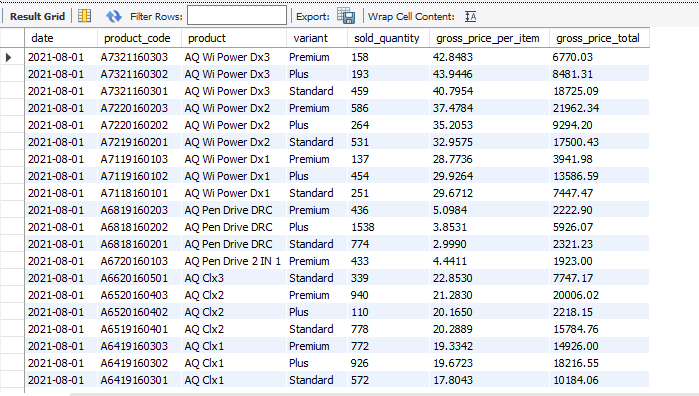
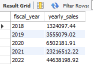
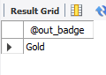
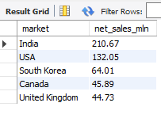
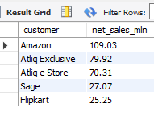
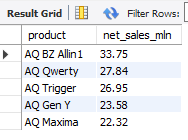
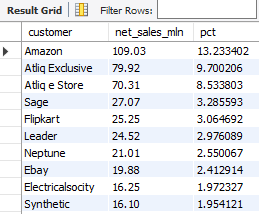
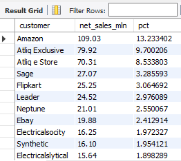

# 📊 AtliQ Hardware Sales & Finance Analytics using MySQL

## 📌 Project Overview

This project focuses on solving real-world business analytics problems using MySQL for AtliQ Hardware.

The project simulates business requirements given by product owners and converts them into SQL-based analytical reports. It covers sales analysis, financial reporting, market performance tracking, and advanced SQL reporting workflows using real business scenarios.

The objective of this project is to demonstrate practical SQL skills used in real-world data analytics and business intelligence environments.

---

# 🚀 Business Problems Solved

## ✅ TASK 1 — Monthly Product Sales Report

Generated a monthly product-level sales report for **Croma India** customer for FY-2021.

The report includes:

* Month
* Product Name
* Variant
* Sold Quantity
* Gross Price Per Item
* Total Gross Price

```sql
select
    s.date, s.product_code,
    p.product,p.variant,
    s.sold_quantity, g.gross_price as gross_price_per_item,
    round(s.sold_quantity*g.gross_price,2) as gross_price_total
from fact_sales_monthly s
join dim_product p
on p.product_code=s.product_code
join fact_gross_price g
on g.fiscal_year=get_fiscal_year(s.date)
and g.product_code=s.product_code
where customer_code=90002002 and
get_fiscal_year(date)=2021
order by date desc
limit 1000000;
```

📸 Result Screenshot:



💡 Insights:
- Helped analyze monthly product sales trends.
- Supported product-level performance tracking.

---

## ✅ TASK 2 — Quarter-wise Product Sales Analysis

Generated individual product sales reports for **Croma India** customer specifically for **Quarter 4 of FY-2021**.
```sql
select
  s.date, s.product_code,
  p.product,p.variant,
  s.sold_quantity, gp.gross_price,
  round(s.sold_quantity*gp.gross_price,2) as gross_sales_price
from fact_sales_monthly s
join dim_product p
on p.product_code=s.product_code
join fact_gross_price gp
on gp.fiscal_year=get_fiscal_year(s.date)
and gp.product_code=s.product_code
where customer_code=90002002 and
get_fiscal_year(date)=2021 and 
get_fiscal_quarter(date)="Q4"
order by date asc
limit 1000000;
```

📸 Result Screenshot:


💡 Insights:
- Identified quarter-specific sales performance.
- Helped compare seasonal product demand.

---

## ✅ TASK 3 — Monthly Gross Sales Report

Created an aggregate monthly gross sales report for **Croma India** to analyze customer revenue contribution.

The report includes:

* Month
* Total Gross Sales Amount

```sql
select 
   s.date,
   round(sum(g.gross_price*s.sold_quantity),2) as gross_price_total
from fact_sales_monthly s
join fact_gross_price g
on 
   g.product_code=s.product_code and
   g.fiscal_year=get_fiscal_year(s.date)
where customer_code=90002002
group by s.date
order by s.date asc;
```

📸 Result Screenshot:


💡 Insights:
- Helped monitor monthly revenue trends.
- Improved financial performance tracking.

---

## ✅ TASK 4 — Yearly Gross Sales Analysis

Generated a yearly gross sales report for **Croma India** using fiscal year calculations.

The report includes:

* Fiscal Year
* Total Gross Sales Amount
```sql
select 
  get_fiscal_year(s.date) as fiscal_year,
  round(sum(g.gross_price*s.sold_quantity),2) as yearly_sales
from fact_sales_monthly s
join fact_gross_price g
on
   g.product_code=s.product_code and
   g.fiscal_year=get_fiscal_year(s.date)
where customer_code=90002002
group by get_fiscal_year(s.date)
order by fiscal_year asc;
```

📸 Result Screenshot:



💡 Insights:
- Enabled yearly sales comparison.
- Helped track business growth across fiscal years.

---

## ✅ TASK 5 — Market Badge Classification using Stored Procedure

Built a Stored Procedure to classify markets based on total sold quantity.

### Badge Logic:

* Gold → Total Sold Quantity > 5 Million
* Silver → Otherwise

### Inputs:

* Market
* Fiscal Year

### Output:

* Market Badge

### Stored Procedure Creation
```sql
CREATE DEFINER=`root`@`localhost` PROCEDURE `get_market_badge`(
in in_market varchar(45),
in in_fiscal_year year,
out out_badge varchar(45)
)
BEGIN
 declare qty int default 0;
 # set default market to be India
if in_market="" then
set in_market="India";
end if;
 # retrieve total qty for a given market+fyear
select
 sum(sold_quantity) into qty
from fact_sales_monthly s
join dim_customer c
on c.customer_code=s.customer_code
where get_fiscal_year(s.date)=2021 and 
c.market=in_market
group by c.market;
# determine market badge
if qty >5000000 then
  set out_badge="Gold";
else 
  set out_badge="Silver";
  end if;
END
```
### Procedure Execution
```sql
set @out_badge = '0';
call gdb0041.get_market_badge('India', 2021, @out_badge);
select @out_badge;
```


💡 Insights:
- Classified markets based on sales quantity.
- Improved market segmentation analysis.

---

## ✅ TASK 6 — Top Markets, Products & Customers Analysis

Generated analytical reports for:

* Top Markets by Net Sales
* Top Products by Net Sales
* Top Customers by Net Sales
for a given financial year.

# Report for top markets
```sql
select 
   market,
   round(sum(net_sales)/1000000,2) as net_sales_mln
from net_sales                                #net_sales selected from views
where fiscal_year=2021
group by market
order by net_sales_mln desc
limit 5;
```

📸 Top Market Screenshot:



# Report for top customers
```sql
select 
   c.customer,
   round(sum(net_sales)/1000000,2) as net_sales_mln
from net_sales ns                      # net_sales selected from views
join dim_customer c
on c.customer_code=ns.customer_code
where fiscal_year=2021
group by c.customer
order by net_sales_mln desc
limit 5;
```

📸 Top Customer Screenshot:



# Report for top products
```sql
SELECT
 product,
 round(sum(net_sales)/1000000,2) as net_sales_mln
FROM net_sales                              # net_sales selected from views
where fiscal_year=2021
group by product 
order by net_sales_mln desc
limit 5;
```
📸 Top Product Screenshot:



💡 Insights:
- Identified top-performing business areas.
- Helped understand customer and product contribution.

---

## ✅ TASK 7 — Net Sales Percentage Share Analysis

Created a report for **Top 10 Customer by Percentage Net Sales Contribution** for FY-2021.
```sql
with cte1 as (
select 
   c.customer,
   round(sum(net_sales)/1000000,2) as net_sales_mln
from net_sales ns                      # net_sales selected from views
join dim_customer c
on c.customer_code=ns.customer_code
where fiscal_year=2021
group by c.customer)
select 
  *,
  net_sales_mln*100/sum(net_sales_mln) over() as pct
from cte1
order by net_sales_mln desc;
```


📸 Result Screenshot:



💡 Insights:
- Identified high revenue generating markets.
- Supported market performance comparison.

---

## ✅ TASK 8 — Net Sales Contribution using Window Functions

Used SQL Window Functions to calculate net sales contribution percentages across different entities.

Implemented advanced analytical calculations using:

* `SUM() OVER()`
* `Custom SQL views : net_sales views`
```sql
with cte1 as (
select 
   c.customer,
   round(sum(net_sales)/1000000,2) as net_sales_mln
from net_sales ns                      # net_sales selected from views
join dim_customer c
on c.customer_code=ns.customer_code
where fiscal_year=2021
group by c.customer)
select 
  *,
  net_sales_mln*100/sum(net_sales_mln) over() as pct
from cte1
order by net_sales_mln desc;
```

📸 Result Screenshot:



💡 Insights:
- Analyzed contribution share across segments.
- Helped understand overall revenue distribution.
- Simplified complex calculation using SQL Views and Windows Functions.

---

## ✅ TASK 9 — Customer & Regional Sales Analysis

Implemented advanced analytical calculations using:
- `SUM() OVER(PARTITION BY region)`
- `Custom SQL views : net_sales views`
- `CTEs`
```sql
with cte1 as (
select 
  c.customer,
  c.region,
  round(sum(net_sales)/1000000,2) as net_sales_mln
from net_sales s
join dim_customer c
on c.customer_code=s.customer_code
where s.fiscal_year=2021
group by customer,region)
select 
  *,
  net_sales_mln*100/sum(net_sales_mln) over(partition by region) as pct
from cte1
order by region,net_sales_mln desc;
```  

📸 Result Screenshot:


💡 Insights:
- Compared customer performance across regions.
- Helped identify strong regional markets.

---

## ✅ TASK 10 — Top Products by Division

Implemented advanced analytical calculations using:
- `DENSE_RANK() OVER(PARTITION BY division)`
- `CTEs`
```sql
with cte1 as (
select
  p.division,
  p.product,
  sum(sold_quantity) as total_qty
from fact_sales_monthly s
join dim_product p
using (product_code)
where fiscal_year=2021
group by p.product ),
cte2 as (
select 
*,
dense_rank() over(partition by division order by total_qty desc) as drnk
from cte1)
select * from cte2 where drnk<=3;
```

📸 Result Screenshot:


💡 Insights:
- Ranked top-performing products within each division.
- Identified highest quantity-selling products for FY-2021.
- Simplified ranking analysis using Window Functions.

---

# 🛠 SQL Concepts Used

* Joins
* Common Table Expressions (CTEs)
* Window Functions
* Views
* Stored Procedures
* Fiscal Year Functions
* Ranking Functions
* Aggregate Functions

---

# ⚙️ Advanced SQL Features Implemented

## User Defined Functions

* `get_fiscal_year()`
* `get_fiscal_quarter()`

## Stored Procedures

* `get_market_badge()`

## Views

* `net_sales()`

## Window Functions

* `RANK()`
* `DENSE_RANK()`
* `SUM() OVER()`

## CTEs

Used for:

* Net Sales Calculations
* Contribution Analysis
* Ranking Reports
* Financial Reporting

---

# 📈 Insights Generated

* Identified top revenue-generating markets
* Evaluated best-selling products
* Analyzed top customers by net sales
* Compared regional sales contribution
* Automated reusable SQL reporting workflows
* Improved business reporting efficiency

---

# 🎯 Learning Outcomes

Through this project, I gained hands-on experience in:

* Advanced SQL Query Writing
* Business Analytics
* Financial Reporting
* Window Functions
* Stored Procedures
* CTEs & Views
* Data Aggregation
* Real-world Sales Analysis
* SQL-based Business Reporting

---
